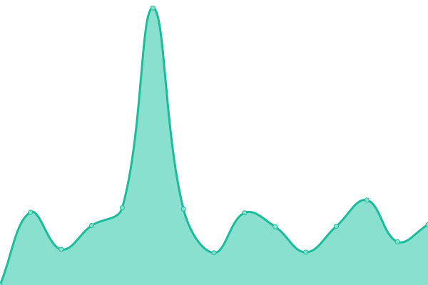

# [📈 Live Status](https://demo.upptime.js.org): <!--live status--> **🟧 Partial outage**

This repository contains the open-source uptime monitor and status page for [Geshi](geshii.moe), powered by [Upptime](https://github.com/upptime/upptime).

With [Upptime](https://upptime.js.org), you can get your own unlimited and free uptime monitor and status page, powered entirely by a GitHub repository. We use [Issues](https://github.com/geshii/status/issues) as incident reports, [Actions](https://github.com/geshii/status/actions) as uptime monitors, and [Pages](https://demo.upptime.js.org) for the status page.

<!--start: status pages-->
<!-- This summary is generated by Upptime (https://github.com/upptime/upptime) -->
<!-- Do not edit this manually, your changes will be overwritten -->
<!-- prettier-ignore -->
| URL | Status | History | Response Time | Uptime |
| --- | ------ | ------- | ------------- | ------ |
|  [based.social](https://based.social) | 🟩 Up | [based-social.yml](https://github.com/geshii/status/commits/HEAD/history/based-social.yml) | 

 806ms
     
 | 

<a href="https://status.miruku.cafe/history/based-social">100.00%</a>
    

|  [Miruku](https://miruku.cafe) | 🟩 Up | [miruku.yml](https://github.com/geshii/status/commits/HEAD/history/miruku.yml) | 

 951ms
     
 | 

<a href="https://status.miruku.cafe/history/miruku">99.29%</a>
    

|  Data01 (Amsterdam) | 🟩 Up | [data01-amsterdam.yml](https://github.com/geshii/status/commits/HEAD/history/data01-amsterdam.yml) | 

 827ms
     
 | 

<a href="https://status.miruku.cafe/history/data01-amsterdam">100.00%</a>
    

|  [PSO2 Map Viewer](http://map.geshii.moe) | 🟩 Up | [pso-2-map-viewer.yml](https://github.com/geshii/status/commits/HEAD/history/pso-2-map-viewer.yml) | 

 240ms
     
 | 

<a href="https://status.miruku.cafe/history/pso-2-map-viewer">100.00%</a>
    

|  [Chibisafe (temp instance)](http://files.geshii.moe) | 🟥 Down | [chibisafe-temp-instance.yml](https://github.com/geshii/status/commits/HEAD/history/chibisafe-temp-instance.yml) | 

 230ms
     
 | 

<a href="https://status.miruku.cafe/history/chibisafe-temp-instance">20.69%</a>
    

<!--end: status pages-->

[**Visit our status website →**](https://demo.upptime.js.org)

## 📄 License

- Powered by: [Upptime](https://github.com/upptime/upptime)
- Code: [MIT](./LICENSE) © [Geshi](geshii.moe)
- Data in the `./history` directory: [Open Database License](https://opendatacommons.org/licenses/odbl/1-0/)
