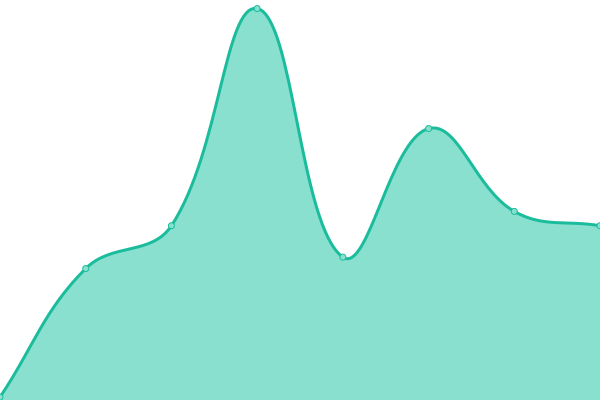
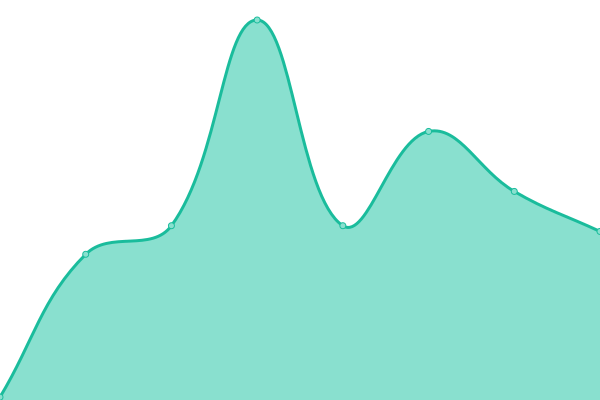

# [📈 Live Status](https://status.miruku.cafe): <!--live status--> **🟧 Partial outage**

This repo is automated and contains a regularly-updated status for the services run by [initmd](geshii.moe), and the [miruku](miruku.cafe) network.

<!--start: status pages-->
<!-- This summary is generated by Upptime (https://github.com/upptime/upptime) -->
<!-- Do not edit this manually, your changes will be overwritten -->
<!-- prettier-ignore -->
| URL | Status | History | Response Time | Uptime |
| --- | ------ | ------- | ------------- | ------ |
|  [koishii.online](https://koishii.online) | 🟥 Down | [koishii-online.yml](https://github.com/vmfunc/status/commits/HEAD/history/koishii-online.yml) | 

 0ms
     
 | 

<a href="https://status.koishii.online/history/koishii-online">0.00%</a>
    

|  [based.social (Mastodon)](https://based.social) | 🟩 Up | [based-social-mastodon.yml](https://github.com/vmfunc/status/commits/HEAD/history/based-social-mastodon.yml) | 

 356ms
     
 | 

<a href="https://status.koishii.online/history/based-social-mastodon">100.00%</a>
    

|  [Miruku (Misskey)](https://miruku.cafe) | 🟩 Up | [miruku-misskey.yml](https://github.com/vmfunc/status/commits/HEAD/history/miruku-misskey.yml) | 

 835ms
     
 | 

<a href="https://status.koishii.online/history/miruku-misskey">100.00%</a>
    

|  [vivid.camp](https://vivid.camp) | 🟥 Down | [vivid-camp.yml](https://github.com/vmfunc/status/commits/HEAD/history/vivid-camp.yml) | 

 0ms
     
 | 

<a href="https://status.koishii.online/history/vivid-camp">0.00%</a>
    

|  [Miruku Radio](https://radio.miruku.cafe) | 🟥 Down | [miruku-radio.yml](https://github.com/vmfunc/status/commits/HEAD/history/miruku-radio.yml) | 

 0ms
     
 | 

<a href="https://status.koishii.online/history/miruku-radio">0.00%</a>
    

|  [cve2k9](https://cve2k9.club) | 🟥 Down | [cve2k9.yml](https://github.com/vmfunc/status/commits/HEAD/history/cve2k9.yml) | 

 0ms
     
 | 

<a href="https://status.koishii.online/history/cve2k9">0.00%</a>
    

|  Data01 (S3) | 🟥 Down | [data01-s3.yml](https://github.com/vmfunc/status/commits/HEAD/history/data01-s3.yml) | 

 774ms
     
 | 

<a href="https://status.koishii.online/history/data01-s3">100.00%</a>
    

|  NyaSafe (Storage) | 🟩 Up | [nya-safe-storage.yml](https://github.com/vmfunc/status/commits/HEAD/history/nya-safe-storage.yml) | 

 166ms
     
 | 

<a href="https://status.koishii.online/history/nya-safe-storage">100.00%</a>
    

|  OwnCast | 🟩 Up | [own-cast.yml](https://github.com/vmfunc/status/commits/HEAD/history/own-cast.yml) | 

 71ms
     
 | 

<a href="https://status.koishii.online/history/own-cast">100.00%</a>
    

|  [Invidious](https://yt.miruku.cafe/) | 🟥 Down | [invidious.yml](https://github.com/vmfunc/status/commits/HEAD/history/invidious.yml) | 

 0ms
     
 | 

<a href="https://status.koishii.online/history/invidious">0.00%</a>
    

|  VPN Server | 🟩 Up | [vpn-server.yml](https://github.com/vmfunc/status/commits/HEAD/history/vpn-server.yml) | 

 94ms
     
 | 

<a href="https://status.koishii.online/history/vpn-server">100.00%</a>
    

|  [Mailserver](vps.srv.janderedev.xyz) | 🟥 Down | [mailserver.yml](https://github.com/vmfunc/status/commits/HEAD/history/mailserver.yml) | 

 0ms
     
 | 

<a href="https://status.koishii.online/history/mailserver">0.00%</a>
    

|  PSO2 Map Viewer | 🟩 Up | [pso-2-map-viewer.yml](https://github.com/vmfunc/status/commits/HEAD/history/pso-2-map-viewer.yml) | 

 78ms
     
 | 

<a href="https://status.koishii.online/history/pso-2-map-viewer">100.00%</a>
    

<!--end: status pages-->

[**Visit our own status website →**](https://status.miruku.cafe)

## 📄 License

- Powered by: [Upptime](https://github.com/upptime/upptime)
- Code: [MIT](./LICENSE) © [Geshi](geshii.moe)
- Data in the `./history` directory: [Open Database License](https://opendatacommons.org/licenses/odbl/1-0/)
